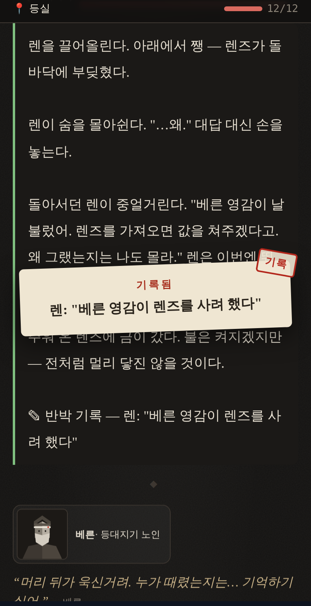
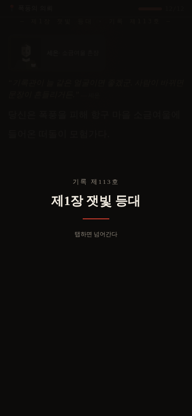

# pt37 — 아이캐치(기록 도장 + 장 전환 카드)

텍스트만 따라가다 집중이 흩어지는 문제 → 애니메이션의 아이캐치처럼 **잠깐 주의를 바꾸는 순간**을 넣었다. 그림 없이 이 게임의 재료(종이·붉은 도장·기록 번호)만 쓴다.

## ① 기록 도장 (중간중간)
- 선택으로 **사건 조각·단서·핵심 결정을 처음 얻는 순간**, 화면 가운데 종이 카드에 "기록됨 — 렌: '베른 영감이 렌즈를 사려 했다'"가 찍히고 붉은 `기록` 도장이 쾅 → 1.2초 뒤 사라진다. 펜 효과음.
- 한 번에 하나: 사건 기록장의 조각 > 단서 > 결정(렌을 붙잡았다·렌즈를 지켰다·묵의 자백 등) 순. 함께 얻은 나머지는 '본 것'으로 둔다(`aduventure_stamps`).
- **이미 찍힌 건 다시 안 찍는다** → 두 번째 판부터는 새로 알게 된 것만 찍힌다(반복 플레이의 보상 신호).
- 입력을 막지 않는다(`pointer-events:none`) — 찍히는 동안에도 바로 다음 선택을 누를 수 있다.
- 이어 하기·장 다시 하기로 기록이 한꺼번에 들어올 때는 조용하다.

## ② 장 전환 카드 (장 사이)
- 각 장(1·2·3장, 에필로그, 사건 2의 1·2·3장, 시즌 1 피날레)을 **처음 시작할 때만** 1.7초 어두운 화면에 "기록 제N호 / 제2장 검은 코트" + 붉은 선이 그어진다. 탭하면 바로 넘어간다(`aduventure_chcards`).

## 공통
- `prefers-reduced-motion`이면 움직임 없이 정지 화면으로.
- 한/영 모두(`STAMP_EXTRA`, `eyeRecord`·`eyeNew`·`eyeSkip`·`eyeStamp`·`eyeSeal`).
- 늘어나는 시간: 장 카드 장마다 최대 1.7초(탭하면 0), 도장은 입력을 막지 않아 0초.

| 도장 | 장 카드 |
|---|---|
|  |  |

## 검증
- 테스트 294개 통과(새 `tests/eyecatch.test.cjs` 4개: 도장 우선순위·중복 방지·장 카드 조건·한/영·입력 비차단·움직임 줄이기).
- 실제 브라우저(한/영): 새 게임 → 1장 카드, 1.8초 뒤 사라짐 / 이어 하기 직후엔 도장 없음 / 렌을 붙잡으면 도장 / 다음 판에 같은 선택이면 도장 없음 / 2장 끝 → 3장 카드. 오류 0.
- 전투 밸런스 시뮬 동일, 1000명 시뮬 막힘·오류 0(시뮬은 연출 시간을 재지 않음).
