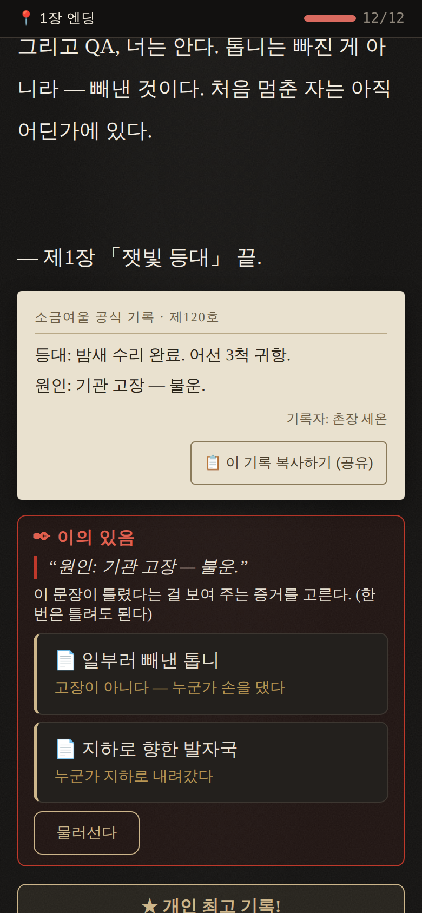

# pt38 — 「이의 있음」 쉽게: 무엇을 하는지 바로 보이게

사람 플레이테스트(선생님): **"이의 있음 너무 어려워. 뭘 어떻게 해야 할지 모르겠다."**

## 원인
1. 시작하면 먼저 "어느 줄이 거짓인가?"를 물었다 — 무엇과 비교하라는 건지 설명이 없었다(사실 거짓 줄은 늘 '원인/배후/경위' 줄).
2. 뒤집을 증거가 하나도 없어도 들어갈 수 있었다 → 줄을 고른 뒤에야 "내밀 증거가 없다"(헛걸음).
3. 목표("증거 하나로 거짓 문장을 뒤집으면 다음 장 운명 주사위 +1")가 어디에도 안 쓰여 있었다.

## 고침
- **줄 고르기 단계 삭제** → 시작하면 거짓 문장을 바로 인용하고 증거만 고른다. ("이 문장이 틀렸다는 걸 보여 주는 증거를 고른다. (한 번은 틀려도 된다)")
- **시작 버튼 아래 한 줄 설명**: "공식 기록의 거짓 문장 하나를, 당신이 모은 증거 하나로 뒤집는다. 성공하면 다음 장 운명 주사위 +1."
- **증거가 없으면 잠금 + 무엇이 있으면 되는지**: "아직 뒤집을 증거가 없다. 이 가운데 하나만 있으면 된다: 일부러 빼낸 톱니 · 렌의 증언 · …"
- 고민은 남긴다: 가진 증거 중 맞는 것(예: 일부러 빼낸 톱니)과 아닌 것(지하로 향한 발자국)을 고르고, 한 번 틀려도 이유("그건 이 줄과 부딪치지 않는다")를 보여 준 뒤 한 번 더.

## 검증
- 테스트 294개 통과(`objection.test.cjs`: 줄 고르기 단계 없음, 목표 설명, 증거 없으면 잠금·필요한 증거 목록).
- 실제 브라우저(한국어): 증거 있음 → 바로 거짓 문장 + 증거 2개 / 증거 없음 → 잠금 + 목록. 오류 0.
- 전투 밸런스 시뮬 동일, 1000명 시뮬 막힘·오류 0.
